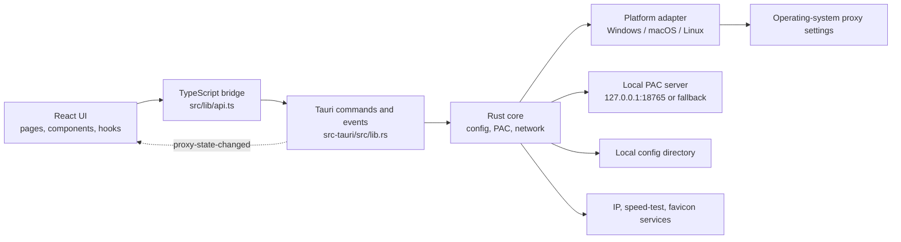
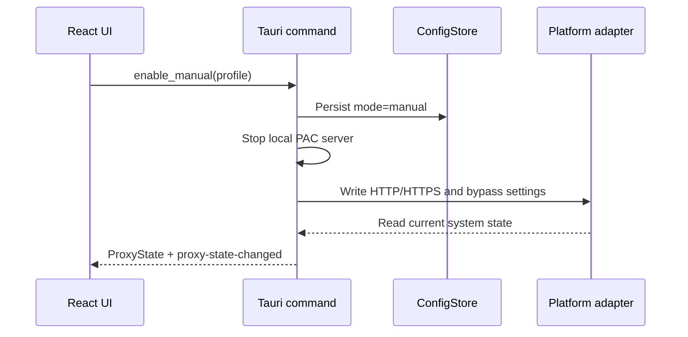
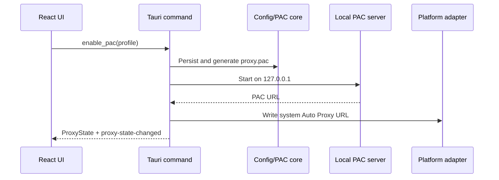

# Haruha Architecture

English | [简体中文](../zh-CN/architecture.md)

This document describes Haruha's runtime boundaries, module responsibilities, critical data flows, and extension points based on the current source. The primary Windows path has development and packaging evidence. macOS and Linux source implementations do not, by themselves, constitute formal platform delivery.

## 1. Goals and non-goals

Haruha is a system proxy configurator. It writes a user-provided upstream HTTP proxy into operating-system settings, or generates a PAC file and points the system to a local PAC URL.

It does not implement HTTP/SOCKS/VPN tunneling, relay application traffic, store proxy usernames or passwords, or provide proxy servers. Whether traffic uses the proxy ultimately depends on the operating system and whether the target application honors system proxy settings.

## 2. High-level structure



## 3. Layers and directories

| Path | Responsibility |
| --- | --- |
| `src/app/HaruhaApp.tsx` | Application shell, active view, bootstrap, mode switching, toasts, and cross-page state |
| `src/pages/` | Overview, proxy configuration, PAC rules, and settings pages |
| `src/components/` | Layout, feedback, tray panel, and small reusable components |
| `src/hooks/` | Theme, split layout, speed history, traffic sampling, and toast state |
| `src/lib/api.ts` | Tauri `invoke`/event boundary plus browser-preview mock data |
| `src/lib/types.ts` | Frontend domain types, kept aligned with Rust serialization |
| `src-tauri/src/lib.rs` | Command registration, shared state, tray, window lifecycle, and mode orchestration |
| `src-tauri/src/config.rs` | Configuration loading, migration, sanitization, persistence, PAC file, and app log |
| `src-tauri/src/models.rs` | Rust domain models, defaults, and rule classification |
| `src-tauri/src/pac.rs` | PAC rule normalization, deduplication, and script generation |
| `src-tauri/src/pac_server.rs` | Loopback-only PAC HTTP server |
| `src-tauri/src/net.rs` | Proxy test, IP lookup, and download-speed test |
| `src-tauri/src/traffic_monitor.rs` | Elevated Windows ETW collection, session totals, and application icon reads |
| `src-tauri/src/platform/` | Operating-system proxy state adapters |
| `src-tauri/capabilities/` | Tauri window permission boundary |
| `scripts/` | Environment check, optional Cargo proxy wrapper, and Windows release helpers |

## 4. Core data model

`ProxyProfile` is the primary configuration unit: `host`, `port`, `mode`, local bypass rules, PAC rules, and user overrides for built-in direct rules. `UnifiedLists` is shared across profiles and contains independently enabled direct and proxy lists.

`ProxyState` is runtime state: current mode, manual address or PAC URL, platform capabilities, and the last error. TypeScript uses camelCase; Rust structures use Serde `rename_all = "camelCase"` to match it.

Rules have three classes:

- Domain: domain-suffix matching.
- Cidr: IPv4 CIDR or dotted masks, fully supported only in PAC mode.
- Glob: shell-style wildcards; URL wildcards containing `://` work only in PAC mode.

## 5. Configuration and local state

Rust uses `dirs::config_dir()/proxy-manager-next` as the configuration root:

```text
proxy-manager-next/
├── config.json       # profiles, active profile, shared lists
├── proxy.pac         # currently generated PAC file
├── logs/app.log      # application action log
└── favicons/*.icon   # quick-site favicon cache
```

When `config.json` does not exist, startup read-only checks legacy Windows locations for `proxy_config.json`, converts it, and writes the new configuration without modifying the old file. UI-only preferences—theme, split widths, speed-test configuration, and speed history—live in the WebView's `localStorage`.

## 6. Frontend/backend command boundary

Tauri commands are grouped by responsibility:

- Configuration: `get_active_profile`, `save_profile`, `get_unified_lists`, `save_unified_lists`
- Modes: `get_proxy_state`, `enable_manual`, `enable_pac`, `disable_proxy`
- Network: `test_proxy`, `refresh_ip_info`, `run_proxy_speed_test`, `run_direct_speed_test`, `get_network_traffic_sample`
- Application traffic: `get_traffic_monitor_capability`, `start_traffic_monitor`, `get_traffic_monitor_snapshot`, `stop_traffic_monitor`, `get_traffic_application_icon`
- Local capabilities: log append, configuration directory, quick-site favicons, and restricted external URL opening
- Window/tray: show the main window, hide the tray panel, and exit

After a successful mode change, Rust emits `proxy-state-changed` so the main window and tray panel share the same state source. Blocking operating-system calls run through Tauri's async runtime with `spawn_blocking`.

## 7. Critical runtime flows

### Manual proxy



Manual mode writes the upstream address directly to the operating system; Haruha does not relay the traffic locally.

### PAC auto-proxy



The preferred port is `18765`; if occupied, the server chooses an available loopback port. On restore, a saved PAC mode recreates the server and writes the new dynamic URL.

### Traffic monitoring

On Windows, the system-interface chart and per-application totals are separate data paths. The chart samples cumulative counters for active physical interfaces once per second, excludes virtual and loopback adapters, and keeps only the latest 60 points in memory. The first application-monitoring start in each Haruha process launches a separate elevated helper mode of the same executable through UAC. That helper consumes ETW TCP/UDP events for IPv4 and IPv6 and sends one cumulative snapshot every five seconds over a local-only randomized named pipe.

The helper accumulates only PID, direction, and byte count, then merges processes by executable. Loopback traffic is excluded and `System/Unknown` remains an explicit item. The application shell owns the session, so view changes and hiding to the tray do not interrupt it. Disabling monitoring stops ETW and clears the current totals while retaining an idle helper that collects no data. Re-enabling monitoring in the same Haruha process reuses that helper without another UAC prompt and starts at zero; explicitly exiting Haruha shuts the helper down. UAC cancellation, pipe timeout, or ETW failure produces an explicit error without estimated fallback data and does not stop the system-interface chart. Capability queries report per-application breakdown as unsupported on macOS and Linux.

### Disable and exit

Disable first turns off the operating-system proxy, then stops the PAC server and persists `mode=off`. Closing the main window normally hides it to the tray. An explicit exit stops application-traffic collection and attempts to disable the system proxy first. A force-killed process cannot guarantee cleanup.

## 8. Platform adapters

- Windows: current-user `Internet Settings` registry values—`ProxyEnable`, `ProxyServer`, `ProxyOverride`, and `AutoConfigURL`—followed by a WinINet refresh notification.
- macOS: enumerates `networksetup -listallnetworkservices` and applies HTTP/HTTPS Web Proxy or Auto Proxy URL settings per service.
- Linux: uses `gsettings` on GNOME/Cinnamon/Unity; KDE is currently detected and reported as limited.

See [Platform support](platform-support.md) for the capability and validation matrix.

## 9. Network and privacy boundaries

In addition to the configured proxy, current network features may contact Google connectivity checks, several public IP-information services, Cloudflare's default proxied speed-test URL, the Tencent Cloud mirror used by the default direct speed test, Google/DuckDuckGo/target-site favicon endpoints, and quick sites explicitly opened by the user. Those services may observe the request IP, User-Agent, and requested domain.

Haruha has no telemetry or analytics module. The system overview reads aggregate byte counters for active physical interfaces, excludes virtual and loopback adapters, and does not represent proxy-only traffic. Accurate Windows application totals require continuously consuming ETW network events in the background; the collector accumulates only PID, direction, and byte count and resolves application names/icons locally. Source and destination addresses are inspected transiently inside the event callback only to reject loopback traffic, then discarded. Network content, domains, IP addresses, ports, per-second history, and per-application live rates are never returned or retained. Application totals exist only in memory and are cleared when monitoring stops or the app exits.

## 10. Security model

- The PAC server binds to `127.0.0.1`, never a LAN address.
- The external-open command accepts only `http://` and `https://` URLs.
- Tauri capabilities grant the main and tray windows only the required core/window permissions.
- Windows application-traffic collection requires explicit UAC confirmation on its first start in each Haruha process. Disabling monitoring leaves the elevated helper idle without an active ETW session, and explicitly exiting the app destroys it. The main process and helper authenticate over a randomized named pipe with a session token plus collection run ID and reject remote pipe clients.
- Configuration is stored in the current user's directory; configuration and logs must never be committed.
- Platform adapters are the highest-risk boundary. Every write must return a concrete failure and must never claim success without evidence.
- Windows portable updates first obtain the version, asset size, and SHA-256 from an HTTPS static manifest, then fall back to the GitHub Release API when the manifest is unavailable or invalid. Each channel tries the configured proxy first and then a direct connection. After download, Haruha verifies the byte size, SHA-256, and PE header before an exit-time helper replaces the executable and restores the previous version on failure.
- The manifest and executable do not yet carry an independent digital signature. SHA-256 alone cannot protect against simultaneous compromise of the release account or manifest, so public releases should still be Windows code-signed and both manifests and assets must be distributed over HTTPS.

## 11. Extension rules

- Put new operating-system behavior in `platform/` behind the shared interface; do not assemble system commands in React.
- Keep Rust and TypeScript models aligned and add Serde defaults or migration logic for persisted fields.
- Add `pac.rs` unit tests before changing PAC semantics, then update both language versions of the documentation.
- Reuse existing commands and `proxy-state-changed` for tray actions rather than creating a second state machine.
- Before declaring a platform supported, test enable, switch, restart, exit, and failure recovery on that real operating system.
