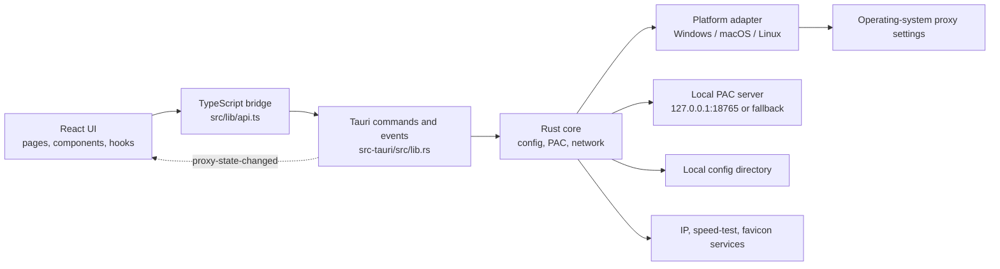
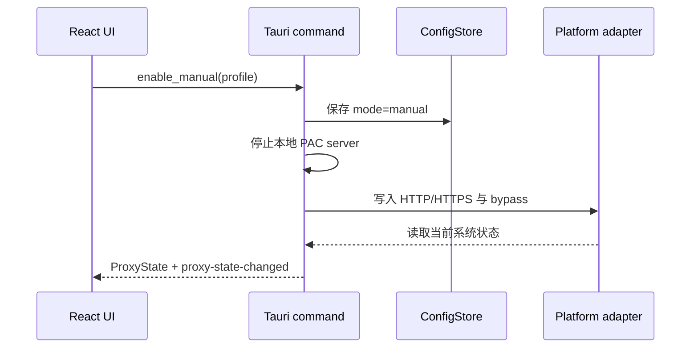
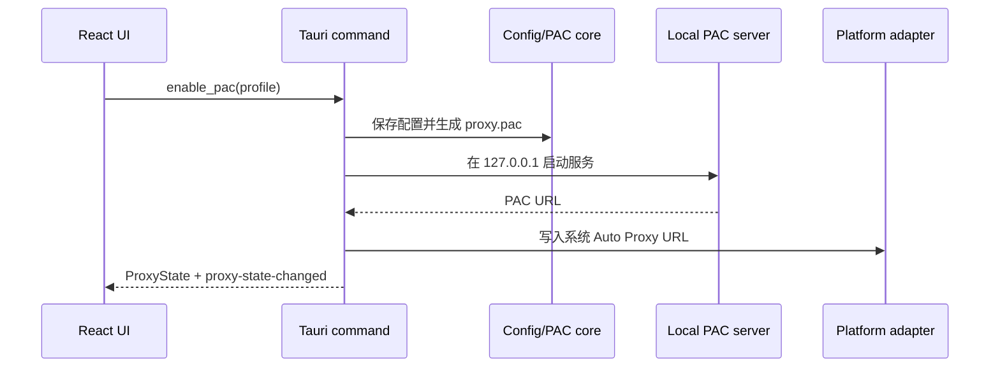

# Haruha 架构说明

[English](../en/architecture.md) | 简体中文

本文以当前源码为准，描述 Haruha 的运行边界、模块职责、关键数据流和扩展位置。Windows 主链路已有开发与打包验证；macOS 和 Linux 的源码存在，但不能据此宣称已经完成正式平台交付。

## 1. 目标与非目标

Haruha 是“系统代理配置器”，负责把用户给出的上游 HTTP 代理写入操作系统设置，或生成 PAC 并让系统使用本机 PAC URL。

它不实现 HTTP/SOCKS/VPN 隧道，不接管业务流量，不保存代理账号密码，也不提供代理节点。流量是否经过代理，最终取决于操作系统和目标应用是否遵循系统代理设置。

## 2. 总体结构



## 3. 分层与目录

| 路径 | 职责 |
| --- | --- |
| `src/app/HaruhaApp.tsx` | 应用壳、活动页面、启动加载、模式切换、Toast 和跨页面状态 |
| `src/pages/` | 总览、代理配置、PAC 规则和设置页面 |
| `src/components/` | 布局、反馈、托盘面板和轻量复用组件 |
| `src/hooks/` | 主题、分栏、测速历史、流量采样和提示状态 |
| `src/lib/api.ts` | Tauri `invoke`/事件边界及纯浏览器预览的模拟数据 |
| `src/lib/types.ts` | 前端领域类型，应与 Rust 序列化结构保持一致 |
| `src-tauri/src/lib.rs` | 命令注册、共享状态、托盘、窗口生命周期和模式编排 |
| `src-tauri/src/config.rs` | 配置加载、迁移、清洗、持久化、PAC 文件与应用日志 |
| `src-tauri/src/models.rs` | Rust 领域模型、默认配置和规则分类 |
| `src-tauri/src/pac.rs` | PAC 规则归一化、去重和脚本生成 |
| `src-tauri/src/pac_server.rs` | 只监听回环地址的 PAC HTTP 服务 |
| `src-tauri/src/net.rs` | 代理连接测试、IP 查询和下载测速 |
| `src-tauri/src/traffic_monitor.rs` | Windows 提权 ETW 应用流量采集、会话累计和应用图标读取 |
| `src-tauri/src/platform/` | 各操作系统的代理状态读取和写入适配器 |
| `src-tauri/capabilities/` | Tauri 窗口权限边界 |
| `scripts/` | 环境检查、通用 Cargo 代理包装和 Windows 发布辅助脚本 |

## 4. 核心数据模型

`ProxyProfile` 是主要配置单元：`host`、`port`、`mode`、本地绕过列表、PAC 规则，以及用户对内置直连规则的删除/停用覆盖。`UnifiedLists` 在所有 profile 之间共享，包含可独立启停的直连和代理名单。

`ProxyState` 是运行状态：当前模式、手动代理地址或 PAC URL、平台能力和最后错误。前端 TypeScript 使用 camelCase；Rust 结构通过 Serde 的 `rename_all = "camelCase"` 与其对齐。

规则分为三类：

- Domain：域名后缀匹配。
- Cidr：IPv4 CIDR 或点分掩码，只在 PAC 中完整生效。
- Glob：Shell 风格通配符；包含 `://` 的 URL 通配符只在 PAC 中生效。

## 5. 配置与本地状态

Rust 使用 `dirs::config_dir()/proxy-manager-next` 作为配置根目录：

```text
proxy-manager-next/
├── config.json       # profiles、活动 profile、统一名单
├── proxy.pac         # 当前生成的 PAC 文件
├── logs/app.log      # 应用操作日志
└── favicons/*.icon   # 快捷站点图标缓存
```

首次没有 `config.json` 时，会只读检查 Windows 旧目录中的 `proxy_config.json`，转换后写入新目录，不修改旧文件。主题、分栏宽度、测速配置和测速历史等纯 UI 偏好保存在 WebView 的 `localStorage`。

## 6. 前后端命令边界

Tauri command 按职责分组：

- 配置：`get_active_profile`、`save_profile`、`get_unified_lists`、`save_unified_lists`
- 模式：`get_proxy_state`、`enable_manual`、`enable_pac`、`disable_proxy`
- 网络：`test_proxy`、`refresh_ip_info`、`run_proxy_speed_test`、`run_direct_speed_test`、`get_network_traffic_sample`
- 应用流量：`get_traffic_monitor_capability`、`start_traffic_monitor`、`get_traffic_monitor_snapshot`、`stop_traffic_monitor`、`get_traffic_application_icon`
- 本地能力：日志、配置目录、快捷站点图标、受限外部 URL 打开
- 窗口/托盘：显示主窗口、隐藏托盘面板、退出

Rust 成功切换模式后广播 `proxy-state-changed`，使主窗口和托盘面板使用同一状态源。阻塞式操作系统调用通过 Tauri 异步运行时的 `spawn_blocking` 执行，避免占用异步执行线程。

## 7. 关键运行流程

### 手动代理



手动模式直接把上游地址写入系统，不经过 Haruha 本机转发。

### PAC 自动代理



优先端口为 `18765`；被占用时自动选择可用回环端口。应用恢复时，如果保存模式是 PAC，会重新启动服务并重写动态 URL。

### 流量监控

Windows 系统网卡曲线和应用累计是两条独立数据链：系统曲线每秒读取已启用物理网卡的累计计数器，排除虚拟网卡与回环网卡，并只在内存中保留最近 60 个点；应用统计在本次 Haruha 运行期间首次开启监控时通过 UAC 启动同一可执行文件的独立提权 Helper，使用 ETW 覆盖 TCP/UDP 与 IPv4/IPv6，并通过仅限本机的随机命名管道每 5 秒返回一次累计快照。

应用采集器只累计 PID、方向和字节数，再按可执行文件合并多进程；回环流量被排除，“系统/未知”保留为独立统计项。该状态由应用壳持有，因此切换页面或隐藏到托盘不会中断。手动关闭监控会真正停止 ETW 并清空本次数据，但保留不采集数据的空闲 Helper；同一次 Haruha 运行内重新开启会复用该 Helper、从零开始且不再请求 UAC。明确退出 Haruha 时会关闭 Helper。UAC 被取消、采集器连接超时或 ETW 异常时返回明确错误，不回退到估算数据，也不影响系统网卡曲线继续工作。macOS/Linux 的能力查询会明确返回不支持应用拆分。

### 关闭与退出

关闭模式先关闭系统代理，再停止 PAC 服务并持久化 `mode=off`。普通关闭主窗口只隐藏到托盘；明确退出时会停止应用流量采集，并尝试先关闭系统代理。进程被强制终止时无法保证清理完成。

## 8. 平台适配

- Windows：当前用户 `Internet Settings` 注册表；写入 `ProxyEnable`、`ProxyServer`、`ProxyOverride`、`AutoConfigURL`，再通知 WinINet 刷新。
- macOS：遍历 `networksetup -listallnetworkservices`，对各网络服务写入 HTTP/HTTPS Web Proxy 或 Auto Proxy URL。
- Linux：GNOME/Cinnamon/Unity 使用 `gsettings`；KDE 目前只检测并返回限制说明。

能力矩阵和真实验证边界见[平台支持说明](platform-support.md)。

## 9. 网络与隐私边界

除用户配置的代理外，当前网络功能可能访问：Google 连通性测试、多个公网 IP 信息服务、Cloudflare 默认代理测速地址、腾讯云镜像默认直连测速地址、Google/DuckDuckGo/目标网站图标地址，以及用户点击的快捷站点。第三方服务可能观察到请求 IP、User-Agent 和目标域名。

Haruha 当前没有遥测或分析模块。系统流量概览读取已启用物理网卡的累计收发字节，排除虚拟与回环网卡，但仍不能表示“仅代理流量”。Windows 应用统计依赖后台持续接收 ETW 网络事件以保证累计准确，只累计 PID、收发方向和字节数，并在本机解析应用名称/图标；源/目的地址仅在事件回调中瞬时用于排除回环，随后立即丢弃，不会返回或保存网络内容、域名、IP 地址、端口、逐秒历史或应用实时速率。所有应用累计仅保存在内存中，关闭监控或退出后清空。

## 10. 安全模型

- PAC 服务绑定 `127.0.0.1`，不监听局域网地址。
- 外部打开命令只接受 `http://` 或 `https://` URL。
- Tauri capability 只授予主窗口和托盘窗口所需的 core/window 权限。
- Windows 应用流量采集在每次 Haruha 运行期间首次开启时必须由用户确认 UAC；关闭监控后提权 Helper 仅空闲等待，不继续运行 ETW，明确退出应用时销毁。主进程与 Helper 通过随机命名管道、会话令牌和采集轮次握手，拒绝远程管道客户端。
- 配置写入当前用户目录；任何日志和配置都不得提交到公开仓库。
- 平台适配器是最高风险边界，所有写操作必须返回明确错误，不能伪造成功。
- 当前应用未实现自动更新和签名验证；公开发布时应对安装包签名并公布 SHA-256。

## 11. 扩展原则

- 新平台能力放入 `platform/`，通过统一接口暴露，不把系统命令拼装放到 React。
- 新持久化字段在 Rust/TypeScript 两端同步，并为旧配置提供 Serde 默认或迁移。
- PAC 语义变更先补 `pac.rs` 单元测试，再更新中英文文档。
- 托盘操作复用现有命令和 `proxy-state-changed`，不建立第二套状态机。
- 正式宣称平台支持前，必须在对应真实操作系统验证启用、切换、重启、退出和失败恢复。
